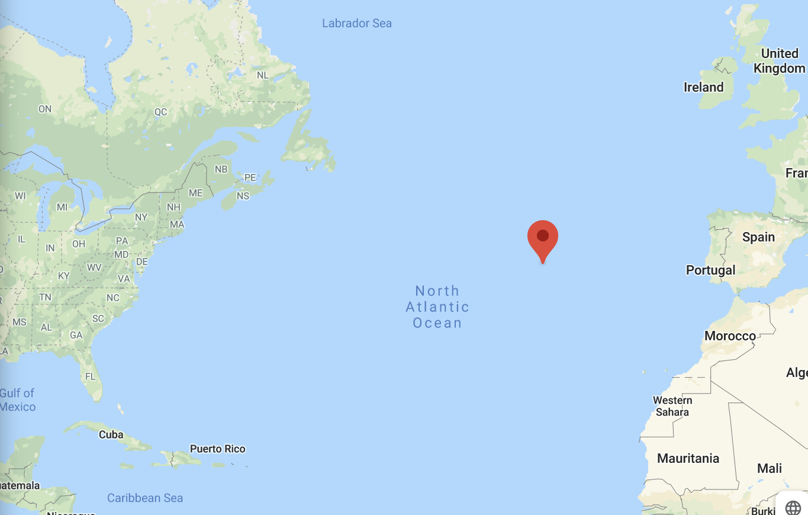
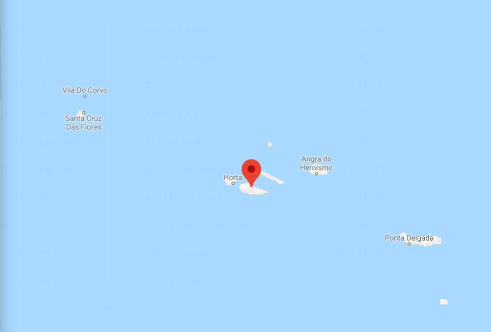

# About Pico Island

### Where is Pico?

[Pico](https://goo.gl/maps/xuPc5xK5mE6DTw48A) is an island in the Azores archipelago, located in the Atlantic Ocean. It’s a part of Portugal 🇵🇹 (and the European Union 🇪🇺).

The archipelago includes 9 islands. Pico is right in the middle of it.

### What makes Pico an amazing place to live?

* **Stunning nature**, including a mountain 🗻, ocean 🌊 , and forest 🌳
* Impressive **sea life**. Wales, dolphins, sharks, orcas and fish hang out here and you can spot them regularly.
* Plenty of **space**.
* Great **climate**, in between mediterranean and tropical. You can grow everything from apples to mangoes, bananas and pineapples 🍍. And it's warm here!
* Plenty of **rainfall** ensuring abundant vegetation and harvest (but not so much **** rain that you get depressed).
* **Low costs** of land, property and living (compared to Western Europe).
* Low income **tax** (tax regime [differs](https://www.icalculator.info/portugal/income-tax-rates/2020.html) from continental Portugal).
* Stable **political situation** (European Union 🇪🇺).
* **Sail** to anywhere ⛵️. Most of the boats coming from the US to Europe stop here.
* High elevation, so if the ice in the Arctic melts, the island won’t disappear.
* A strong sense of **community** **and intentional-living projects**. People really help each other out. Things tend to happen if you put the word out.

### **Potential problems (no place is perfect)**

#### Cows

There are A LOT of cows in the island, partially because the EU donates money for locals to keep them. The cows take a lot of space, and consume a huge amount of water. In case of draught this is absolutely not sustainable.

#### Travel

Since it’s an island, **the connection with the mainland Europe is trickier**. [SATA](https://www.sata.pt/en) operates direct flights from Pico (PIX) to continental Portugal (Lisbon and Porto) and other islands. For other options, you need to fly via the main island in the Azores—São Miguel (Ponta Delgada airport, PDL). SATA flies to continental Portugal, Madeira, Germany (Frankfurt), Canada (Toronto), Capo Verde, and the United States (Boston). Ryanair flies to Lisbon and Porto.

It's worth noting, that SATA offers free inter-island connection flights, as long as they are within 24 hours from arriving / departing from the Azores.

#### Slow Flow of People

This is definitely not London or Barcelona. The closest city (which is still super tiny) is on the neighbouring island of Faial. With that in mind, Pico offers a surprising abundance of activities (organic farming, martial arts, dance, music, hiking, diving, paragliding, activism groups, supporting people with disabilities, animal care, and so much more).

#### Volcano

The archipelago experiences [seismic](https://earthquaketrack.com/r/azores-islands-portugal/recent) and volcanic activity. The last eruption happened in the 1957 near Faial island. Here’s the [wikipedia article](https://en.wikipedia.org/wiki/Natural\_disasters\_in\_the\_Azores) listing natural disasters in the Azores It's not a long list, and Pico appears on it only 19 times since 15th century.

#### Bureaucracy

Portugal is not the easiest place when it comes to dealing with bureaucracy and the island pace makes things move even slower. With that in mind the people are very helpful and there are plenty of us who went through the bureaucratic hoops and can show you the ropes.

**Cars are Expensive**

Living in Pico without a car is very tricky (although possible) and unfortunately Portugal is one of the worst places in Europe to buy a car. And since s not uncommon to be asked to pay quadruple value of the car in import tax, buying a car in another country is not really a viable option. It's cheaper to buy in mainland Portugal, however that adds additional \~€500 in shipping. All things considered, it's still possible to buy a car for a semi-decent price in Pico if one is willing to spend some time looking.

**Bottom Line: Pico seems to be quite a robust location for the future.**

### **Pics, or didn't happen! 📸**

Be my guest, here's an [album with Pico Pics](https://photos.app.goo.gl/T1fSqmueGYG2chYg6)
