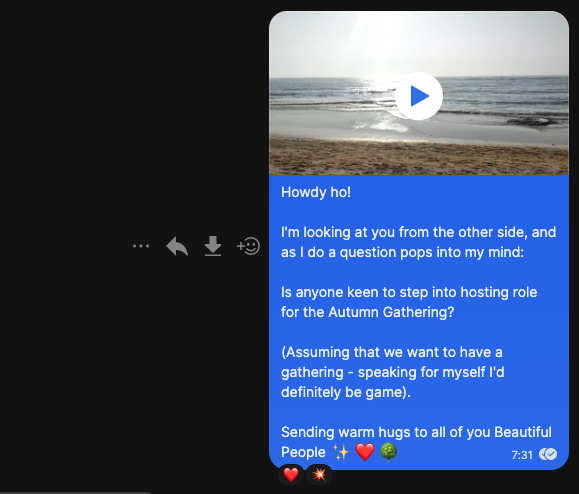
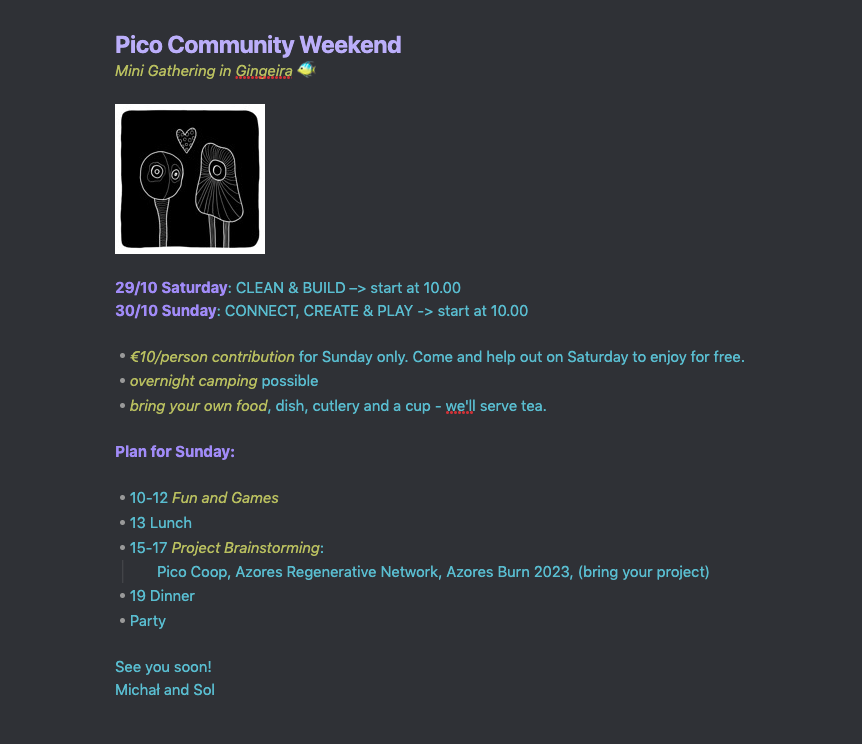

The mini gathering started with a message in our Signal group sent a few months back, after seeing the reminder in my calendar that it's time to move the energy for another [Community Gathering](/projects/gatherings.md).

While there was interest to gather, there seem to be very little hosting energy available. 

I kept an irregular 1:1 chat with the only person to offer to help out. **We decided to create a mini-gathering that requires the least amount of organising work possible** (very different from our previous [Spring Community Gathering](/projects/spring-gathering-2022.md)).

It took shape as the following invitation:

In total, 11 people participated in the weekend, including 2 kids, and 2 people who haven't participated in our events before. 2 people came to visit us from Faial Island.

On Saturday we focused on the Land where we host our events. We did some roof maintenance, cleaning up, weeding, as well as made some improvements - we planted a few trees, created a mini-garden, and begun building a whale watching station using a traditional Azorean design.

On Sunday, we had a free flow mix of conversations and activities.

- We talked about [Traditional Dream Factory](https://traditionaldreamfactory.com) - a regenerative village in mainland Portugal, where I have been a Summer Steward. 
- We discussed how the next stage of our community in Pico could look like. There seems to be some energy to find Land to host events, and explore co-ownership and sharing resources. For context, the Land where we currently host events is one of the possibilities we're exploring ([details in this document](https://docs.google.com/document/d/1Zbz3Ka5x7zVrJwBafn2mdW2oqRrdxNXoIMzwTkZiFIY/edit?usp=sharing)).
- We created a few drawings
- Aaaaand we built a super simple rat trap.
- We also tasted coffee from the beans grown and roasted in the very village where we had our weekend together. Yes, it was delicious. And yes, Azores is the only place in Europe where you can grow coffee trees.

The total income of the event was 20 euro, which was added to our community fund. For more context see [Piconomics](/piconomics-101.md).

## Reflections
- It was absolutely wonderful to see everyone, especially new faces, and have people from Faial with us. Weaving relationships and moving the energy is all about showing up, and it makes my heart sing to feel the energy of the people who do show up.
- I always thought of "community building" as an act of building a community. What if it was all about **a community engaging in an act of building stuff together**? Building a whale watching station and a rat trap was a lot of fun, and a great way of getting to know each other while creating. I recorded a [short video](https://youtu.be/6lbO8ncdsYE) (2m24) on that subject.
- It's still unclear what's the next stage of our community, but the needs and the core team are becoming clearer. The next step is to draw up something more specific and have a few conversations.