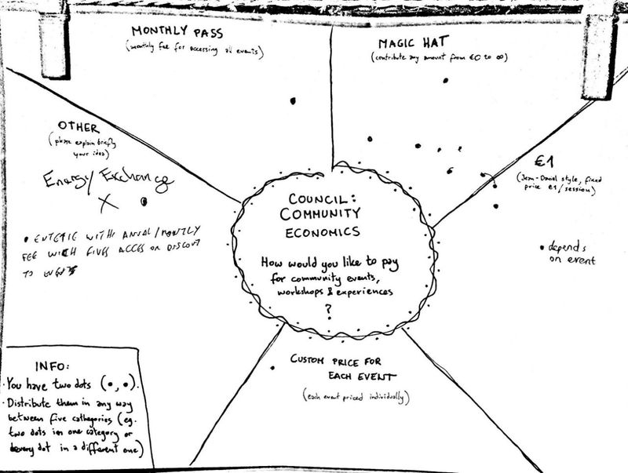
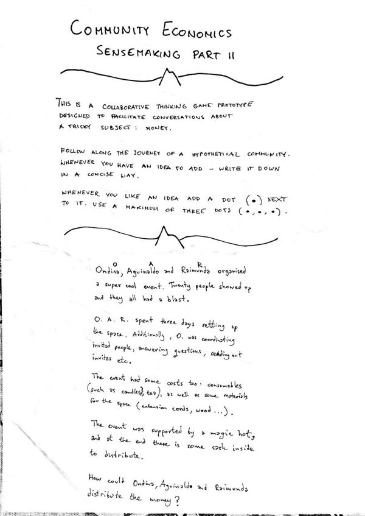
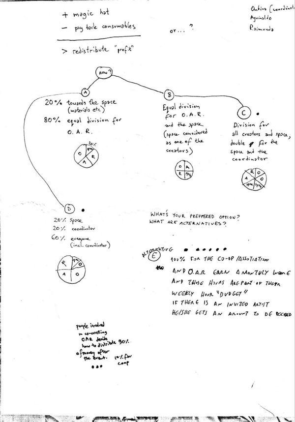

# Piconomics 101 🍪

Our congregation reached a significant milestone - it's time to have a **conversation about sharing money**.

At the moment, gatherings and events are the only income streams of our congregation.

We first experimented with the *Magic Hat* model (voluntary contribution of money and/or energy) to fund our Community Gatherings (Summer 2021, Autumn 2021), and we have always covered the costs and had some extra left at the end. It's worth nothing that we have not been paying the organising teams for their work.

In 2022 we started to hold more community events, which naturally brought up the need to discuss how our congregation would like to handle money.

The process began with a simple sense-making mechanism (*dot voting* - each person has two dots to distribute as they please between the options), reflecting on **how would we want to pay for community events.** *Magic Hat* model was the most popular. 7 people participated in the voting.

We then reflected on **how would we like to distribute the money**, using the *dot voting* system with three dots per person. The most popular option was to *bring 100% of profit into the COOP*, which would then pay a salary to people organising events based on a weekly hour budget. 

Unfortunately only 4 people participated in the voting, and we do not have a COOP established at the time of voting. 

For extra context, in January and February we hosted a total of **5 community events, which brought in a total profit of €76.40**. The events were organised and facilitated by one person, and one of the events received significant help of two other people working on making it happen. Similarly to the Gatherings so far, the organisers have not been paid for their work.

Our next step is to **hold a Piconomics meeting** with the intention of **creating a proposal** of how our Congregation could handle money at this point of time.

It's worth noting that at the moment **our Congregation do not have a decision-making protocol (decision on how to make decisions) nor a clear boundary defining who is making decisions**. Our main focus so far was on bringing people together and building trust. The question of money, decisions etc. seems to be indicating that our Congregation is maturing into the next chapter, which could use a minimum viable structure to support its further evolution.

### Resources
- [4 Decision Methods](https://import.cdn.thinkific.com/241646/4DecisionMethodsforDecentralisedTeams-200303-143417.pdf) by The Hum (from [Patterns for Self-Organising Teams Course](https://www.thehum.org/online-course))
- [Decisions Agreement](https://handbook.enspiral.com/agreements/decisions) from Enspiral Handbook
- [Generative Decision Making Process](https://medium.com/percolab-droplets/generative-decision-making-process-cf0b131c5ac4) by Samantha Slade
- [How we make decentralized decisions](https://medium.com/the-caring-network-company/how-we-make-decentralized-decisions-ad869417b772) by Manuel Küblböck