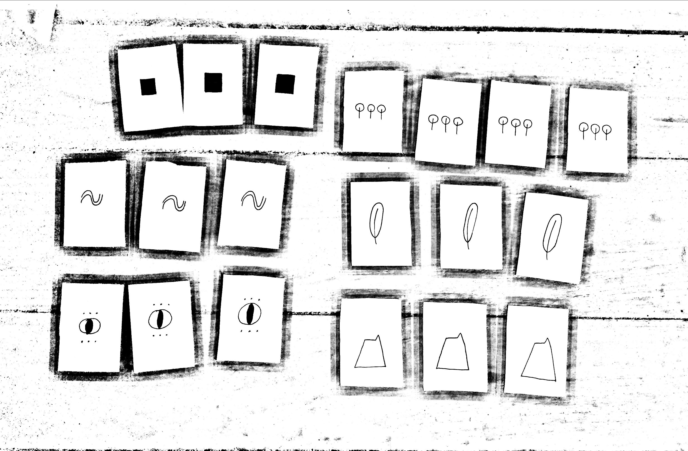

# Autumn Gathering 2021 🍂

Following the success of our first [Summer Gathering](summer-gathering-2021.md), we hosted our second gathering in October 2021.

**The intention was to take the next step in the community building process, by tuning into our individual visions of what community in Pico could look like, and discovering how we could support each other in making these dreams come true in the context of our island with all it's blessings and limitations.**

We called it: _**Stepping Into Belonging**_.

### Practical Details

* **We gathered for 3 full days** plus additional "prep day" and "clean up day".
* **The Gathering was a full-time commitment**, rather than a hop-on/hop-off participation like the \[previous one]. The participants were asked to arrive before the opening session and stay for the entire Gathering, with a possibility to leave for an occasional quick errand, such as feeding the animals.
* **18 people and 3 dogs participated** in the Gathering
* **The core hosting team included four people**, three with a defined area of responsibility (site, food, program) and one with more flexibility ("the joker"). The core team included two first-time organizers, as it's our intention to "train" people in order to distribute hosting and ensure long-term continuity of the gathering.
* **The theme was **_**Stepping Into Belonging**_
* **The food was vegan and gluten-free, created from mostly local and organic ingredients.**
* Participants were asked to bring their own dish, cutlery and cup, and clean after themselves.
* **We explicitly asked not to bring/consume substances (eg. alcohol, weed...) during the Gathering.**
* **The Gathering was free to attend.** We asked for a contribution to the "magic hat", with all the proceeds to be invested in future community events.

Here's [the invitation](https://docs.google.com/document/d/1eJR2D\_6JDtgnR3rmkWuDc4cfRoRpjI3wgysBKjCPdig/edit?usp=sharing) we have sent out to people (edited for privacy), which was followed by an [info pack](https://docs.google.com/document/d/1iXvGUJx\_MIz266k0M216QlPG106CZhpcFyQy\_y3RO70/edit?usp=sharing).

### Site

The venue included a campsite, two private homes opened to the community (with one of them used as a kitchen and meal serving area), a small cabin for children activities, and a ruin covered with a roof. All the spaces were located within 10 minute walking distance.

The weather during the gathering included a lot of heavy rainfall, therefore we had to design the site and activities to happen mostly in sheltered areas.

**Building the roof was the biggest challenge during the site prep**. A team of volunteers coordinated by the core team member responsible for the site managed to build a semi-permanent structure from locally sourced free wood, nails, and tarp. Total cost of the roof: €70 + tarp donated from the community.

[Here's how](https://github.com/heymichal/pico/blob/master/.gitbook/assets/ruin-roof-pico-gathering.pdf) we built the roof.

The roof is not designed to withstand a hurricane, however it has effectively sheltered the participants during heavy rainfalls. We decided to leave it for winter, in order to keep using the space for community events.

Some of the other site prep work involved strengthening the floor of the private home used for cooking and eating, cleaning the campsite, as well as rigging and decorating the ruin.

**While numerous people stepped in to help with the campsite prep, it was not enough human power, leaving the core team member with too much work to complete.** We intend to mitigate this problem next time by closing the registrations earlier, so there is enough time to complete the necessary work, without overburdening the site coordinator.

Note: At the moment, the Gathering is hosted on a privately-owned land. While there is an intention of turning it into a community land, it is not yet clear if and when it will happen. This causes a certain degree of uncertainty related to how much time and energy does the community want to invest in improving the site (eg. by building a proper roof). One of the next steps is to come to a clear agreement with the owner.

### Program

#### Stepping Into Belonging Process

The program was designed around a three-step _Stepping Into Belonging_ process, spread over the three days of the gathering (3 workshops of \~2h each). The process was the only activity which didn't involved children. See a section below to see what they did in that time.

**Day 1 facilitated a self-discovery journey climaxing in verbalising to others what would a dream community look like for each of us as individuals.** The result was a collection of drawings. The key idea was to help people understand what do they actually want from a community, which is a very unspecific umbrella term.

__[_Click here_](../resources/our-dream-communities.md) _to see scans of all the drawings._

**Day 2 took people through an intense speed-dating-like process of short 1:1 connections with everyone, with the intention of sharing what we could do together in each pair.** The goal was to ensure that everyone has a touchpoint with everyone, as well as to allow for more raw, high energy ideas to bubble up spontaneously due to a very short amount of time. The day concluded with an internal processing session, resulting in generating up to 3 project ideas each, which were then shared with the group and grouped on a board.

**Day 3 engaged participants in a collaborative community game (or to be more accurate: collaborative community catalysing process based on game mechanics) with the objective of successfully launching one project**. This will be reviewed in six months time or during the next gathering. The process was based on calling projects into existence and checking which ones have sufficient energy to actually start immediately after the gathering. As a result, 10 projects were called, with 8 gaining sufficient support to start.

Note: While it might seem that the game sets the bar very low (one project out of eight), it is a deliberate choice, as high-energy events can lead to overcomittment and/or underestimating the amount of energy required to launch / run a project. With that in mind, a single successful project will already have a positive impact on the island, and is therefore considered a success.


If you'd like to play this game with your community, you can [get the pdf manual](https://michalkorzonek.com/community-council).


#### Home Pods

All participants (including children) have been randomly distributed into small groups of three, in which they would meet e very day throughout the Gathering to have a moment of checking in with each other. This was intended to help participants share what is going on for them, process the experience, as well as ask for help if needed.

#### Body Connection

A common feedback from the previous gathering pointed towards including more "body" activities. We included a session of guided movement sequence based on yoga and tai-chi, lead by one of the participants.

We also started each of the _Stepping Into Belonging_ workshops with a dancing to one song, from this [funky playlist](https://open.spotify.com/playlist/5889sB1JLFEOMJjnnEV7Wa?si=372573cb289545f3).

#### Community Dance Playlist

The farewell party was centred around a community dance playlist, compiled from songs provided by the participants (one song per person). This turned out to be a great success, and yet another way of getting to know each other, as well as navigating the problem of different tastes in music for a party.

Here's [the playlist](https://open.spotify.com/playlist/5PtdCqzSJFYjsX9GHyLMrd?si=2ccbfc49fb604bc3). And here's [one song](https://www.youtube.com/watch?v=SEbuvkvydNY]\(https://www.youtube.com/watch?v=SEbuvkvydNY) that's not available on Spotify, which was played at the end.

#### Children Activities

The intention of the Gathering was to be as children-involving as possible, and only the _Stepping Into Belonging_ workshops were not designed for them to participate.

During these times, they were supervised by one of the participants (rotating between two people), giving space for the kids to engage in art projects, such as face painting and designing a dream school: _Escola do Mundo._

.jpg>)

#### Other activities

The Gathering also included the opening session, authentic relating games, a sound bath, and a gift night (where each participant was asked to bring a gift - a song, a poem, a story, a game...).

The program was designed with spaciousness in mind, however the space was filled up to delays in food prep. This was unfortunate, as some of the people felt too low energy to participate in the evening activities.

There have been no activities before breakfast, as we tried to incorporate some movement activities during the previous gathering, but there was barely any participation.

Note: Due to the rain only the closing session happened in an outdoors space 🌧 .

#### The Community Artefact

[Amanda](https://www.facebook.com/amandascorerartist/) created a wonderful painting on recycled doors for our first Summer Gathering. At the end, we have all signed it at the back. We've continued this ritual during this Gathering and asked every participant to write something at the back.


The program was designed by [Michal Korzonek](https://michalkorzonek.com).


### Food

The vegan, gluten-free and absolutely delicious food was prepare by a rotating team including two chefs per day, as well as numerous people stepping in to help with the food prep.

⭐️ Our big achievement was coming very close to our objective of being 100% local, with only a few items not sourced from Pico.

Due to complexity of the meals, we misjudged the amount of time it would take to prepare them, which caused delays up to 1h30. This was not ideal, as it didn't allow for some people to participate in the evening activities due to lack of energy. On the other hand, the time in the kitchen was a lot of fun and everyone enjoyed the prepping process.

### Money

We received a total of €220 in the magic hat, which covered the total costs of the gathering of €140. That leaves €80 for organising future events.

### Retrospective

Here's the summary of the retro conducted by the hosting team, as well as key points from the feedback form submitted by participants.

#### Plus (What went well?)

* "Closed gathering" (commitment to be there for the entire process, rather than hop-on/hop-of) - the benefits outweigh the downsides.
* Food almost fully local
* Delicious food
* People stepping in to help with food prep
* Invitation to not consume substances (1 person explicitly named their preference not to have it in place, while a large amount of people explicitly stated that they see it as a good decision)
* Movement in the program
* _Stepping into belonging_ process
* Community dance playlist
* Involvement of kids

#### Minus (How could we improve?)

* Not enough helping hands during the site prep process.
* Food significantly delayed.
* At times, when non-gluten-free or spicy food appeared it wasn't clearly labelled.

#### Next (What are the next steps?)

**Program:**

* Include even more body movement moments, such as short dancing breaks. Possibly include a short (15-30m) pre-breakfast movement slot.
* involve more people in co-creating the program, perhaps using the [Open Space](https://handbook.enspiral.com/guides/retreats#open-space) model.
* have a designated person (or team) to host the farewell party
* include some kind of games and challenges to be played throughout the Gathering. The list can be hanging in one of the common spaces.
* Have a (rotating) person to keep the flow of time and remind people that activities are starting.
* Design the entire process for more proactiveness (this is a bit vague, but it's an intention).
* While keeping the Gathering closed, consider inviting close friends to the Farewell Party to get them involved and share "fruits" of our time together.

**Food:**

* Consider changing the cooking model to: 1 core team member focused on food + 3 chefs (one per day). The team collaborates on creating the menu based on local ingredients in season. The chefs then call for help with food prep during the day. This worked extremely well during this Gathering, when numerous people stepped in to help in the kitchen. A smaller team (3 chefs rather than 6) would also allow for an easier coordination to have a meeting before the gathering.
* Consider designing dinner to be a "recycled" lunch, to reduce the time necessary for food prep.

**Site:**

* Have a conversation with the owner of the land and come to an agreement for the future Gatherings.
* More help during the site prep. Close the list of participants earlier to allow more time for sourcing necessary help.

### Conclusion & Next Steps

The objective of the Gathering was completed, with 8 projects being called into existence and getting support from other community members. We're all more clear on our individual and collective visions for community in Pico. We've also created a sheltered community space for hosting events.

We'd like to continue with hosting the bi-annual Gathering. We'll aim to based the dates around public holidays. Possible dates:

* 22-24 April 2022
* 4-7 June 2022

See the [Pico Gathering Firestarter](../resources/pico-gathering-fire-starter.md) (internal resource) for practical coordinating details.


[Subscribe here](https://picomicrosolidarity.substack.com) to get updates from our community. [Reach out to Michal](https://michalkorzonek.com/#contact) if you have any questions, or would like some help in designing your own community gathering.


### Resources:

* [Pico Gathering Firestarter](../resources/pico-gathering-fire-starter.md)
* [The Community Council Game](https://michalkorzonek.com/community-council)
