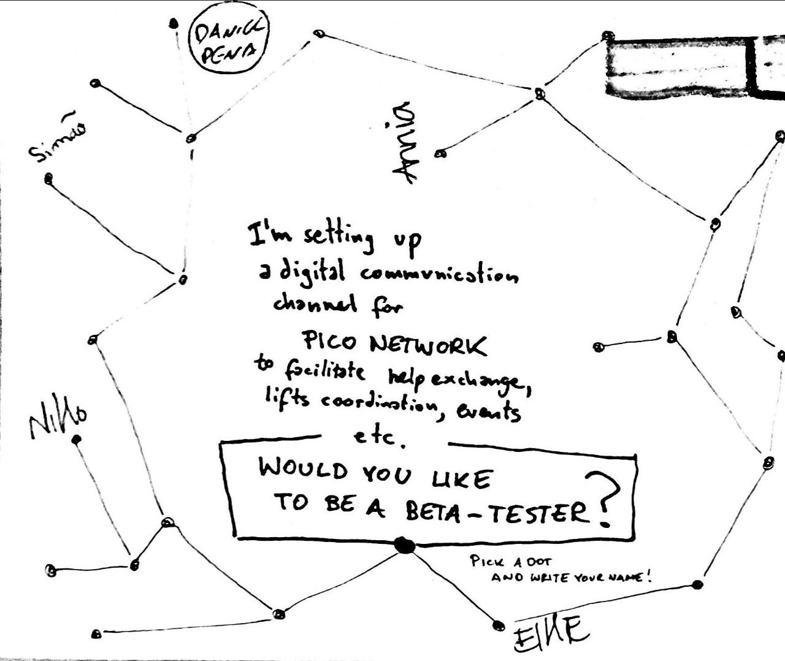

Pico Network is a private and secure digital channel for asynchronous communication in our community.

**The objective is to facilitate gift exchange, share resources, coordinate lifts, announce events, make decisions etc.**

Pico Network was called during our [Autumn Gathering](autumn-gathering-2021.md), during the prototyping session of the [Community Council](https://michalkorzonek.com/community-council).


At the moment Pico Network is in beta. [Subscribe for updates.](https://picomicrosolidarity.substack.com). If you'd like to join the beta testing team, reach out to Michał (community only).


## Onboarding

Please read the following info before joining the network.

1. **Pico Network runs on [Signal](https://signal.org/)** – a free, secure, open source app, operated by a non-profit organisation, making it a no-brainer app of choice. (Optional: read [this guide](https://restoreprivacy.com/secure-encrypted-messaging-apps/) for more info about security.)
2. **Please be mindful not to overload the channel.** Reach out via private message whenever it makes sense, use emoji reactions rather directly on a message rather than sending a separate message etc.
3. **The objective of Pico Network Beta is to gather use cases for the network and build initial momentum.** Whenever you have a real-life-use-case, please use the Network, even if it's functionality is limited due to the small number of people involved.
4. **After one month we'll review the functioning of the Network**.

## Possible Future
As the network grows there are two possible paths to consider:

1. Opening up the network to the wider island community
2. Keeping the network closed

It is likely that we might want to have both options simultaneously. There is also a possibility of moving towards multi-channel structure in the future, however for now it's more effective to keep it simple.

## Log
- October 2021: Project called by Michal during [Pico Autumn Gathering](autumn-gathering-2021.md)
- January 2022: Request for beta tasters

- January 2022: Pico Network Created and invites sent to Beta Testers

