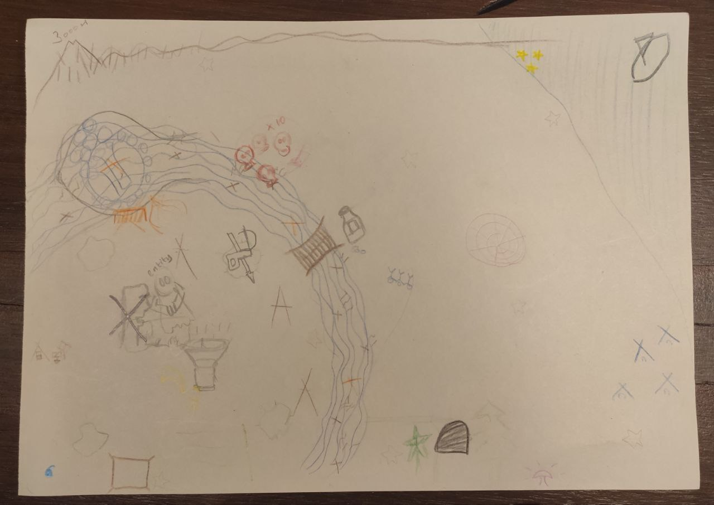

# Sharing Circle v4

### Format

**Bi-weekly sharing circle, every second Sunday,** **starting at 15:00**.&#x20;

During the retrospective of [round 3](sharing-circle-v3.md), we decided to change the format of our sharing circle and make it **more flexible and experimental**.&#x20;

From now on, every circle will be different, depending on what comes up in the moment, or in the week leading up to the circle. Anyone can suggest a meeting spot (doesn't need to be indoors), and an activity (eg. swimming, walking, visiting a cave, singing...). **We won't have sharing as a "fixed" part of the structure** (in fact, there is no structure), but there is an intention to keep the sharing component, so **we'll allow it to emerge naturally**.

**The main intention is to keep connecting in a meaningful way through different types of activities.**

Since this is a more experimental round, we'll shorten the cycle until the next retrospective, and review our progress on the 4th circle.

### New People

There's one person who expressed interest in joining our sharing circle. We'll keep the doors open and allow new people to join organically whenever interest arises.

### Activities

Circle 1: Short sharing circle + hike

Circle 2: Playing the [Quiet Year,](https://buriedwithoutceremony.com/the-quiet-year) a collaborative map-making game about a community

