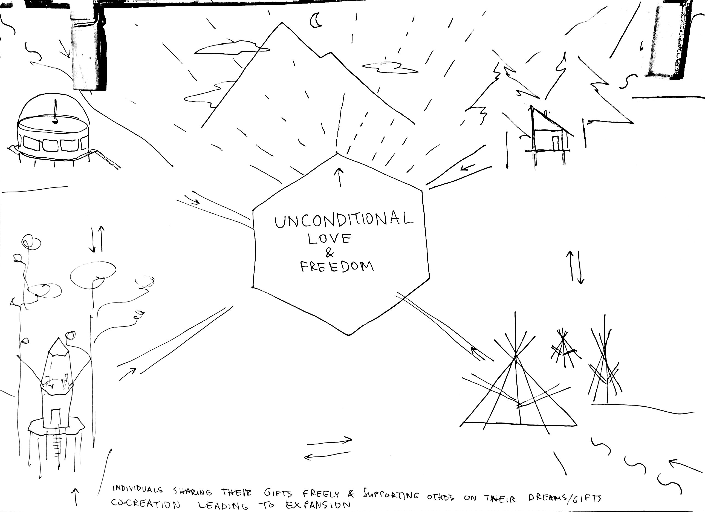
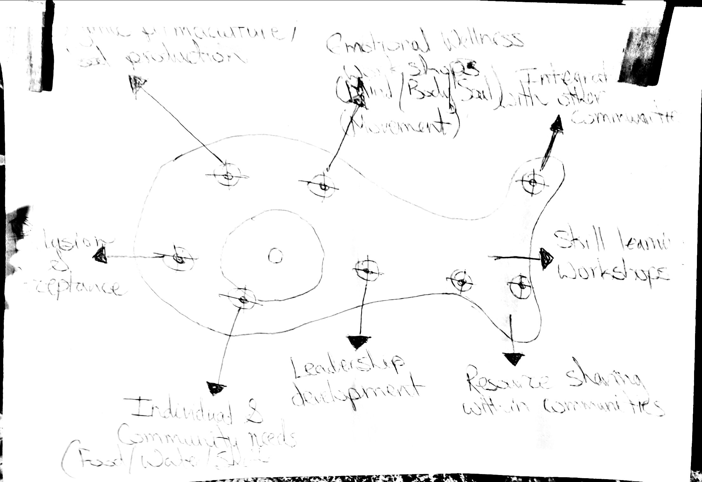
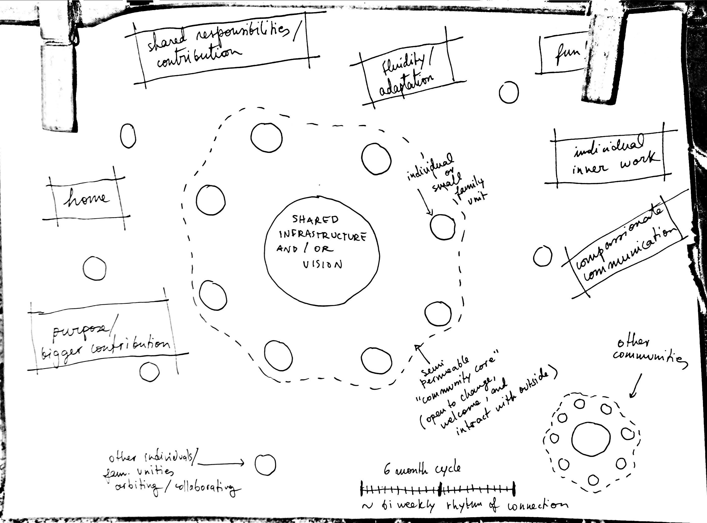

# Our Dream Communities

The drawings below have been created by the participants of the [Pico Autumn Gathering 2021](../projects/autumn-gathering-2021.md), during the Stepping Into Belonging process.

Presenting the drawings to everyone concluded the first day of the process, designed to help participants reflect on what is their individual vision of an ideal community.

.jpg>)

.jpg>)

.jpg>)

.jpg>)

.jpg>)

.jpg>)

.jpg>)

[Back to Pico Autumn Gathering 2021.](../projects/autumn-gathering-2021.md)
