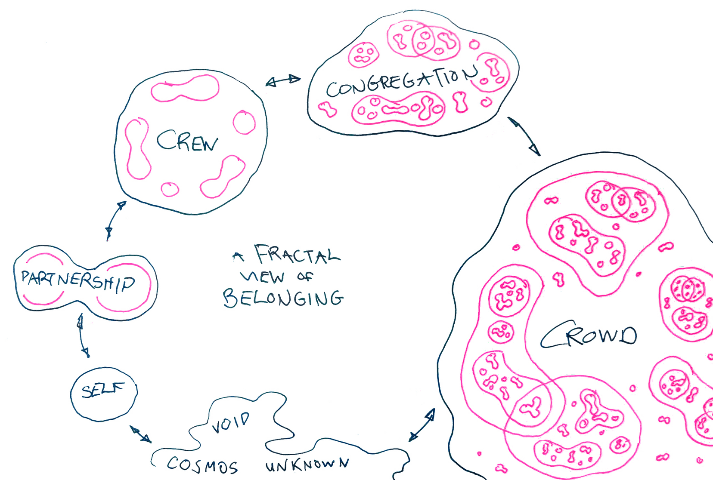

# What is Microsolidarity?

[Microsolidarity](https://microsolidarity.cc) is a methodology for community building, focused on peer-to-peer support and mutual aid.

It provides a lens for thinking about groups at different scales:

1. The "dyad"—a relationship between two people, eg. a couple.
2. The "crew" (sometimes called "pods")—a small group of 3-6 people who support each other in their personal or professional development.
3. The "congregation"—an organisation, network or community.

**The crews are intimate spaces enabling peers to achieve high level of impact at a low coordination cost**. The crews can produce an output, such as a project, product, or a company, or focus entirely on peer-support and personal development.

**The crews co-develop within the congregation, which allows for effective sharing of resources and maximising opportunities and reach** via the extended network. The congregation acts as a dating pool for individuals to meet the right people to launch crews with.

**Our intention is to create an island-level congregation and launch multiple crews and projects aimed at making Pico one of the most amazing places to live on Earth 💫.**

_Sources:_ [_Microsolidarity_](https://microsolidarity.cc) _by Richard D. Bartlett and_ [_The Hum_](https://www.thehum.org)_._

### Learn more about Microsolidarity:



You can also learn experientially and **join the** **Microsolidarity Practice Program** (highly recommended):



__
